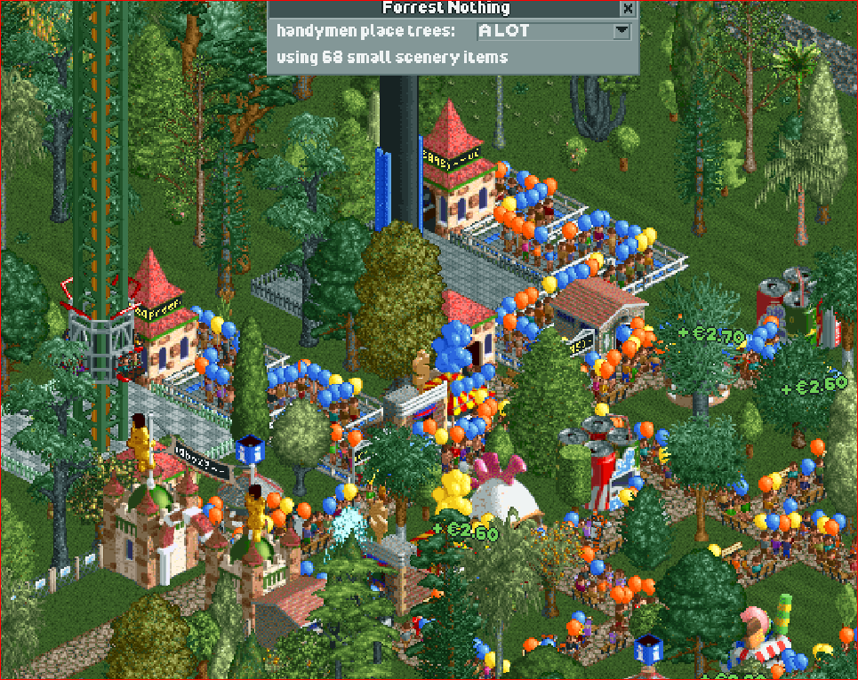

# Forest Nothing / Handymen Place Trees

Ever get tired of placing trees? Why not pay someone to do it for you?

Handymen will place trees and small bushes while mowing. The amount of stuff placed can be configured.

## Installation

like other plugins, find your plugin folder at `Documents/OpenRCT2/plugin` and add `forrest-nothing.js` to the list!


## Notes
Not tested for multiplayer. If you encounter any issues, please let me know.

scenery is loaded from the following scenery groups:
```
'rct2.scenery_group.scgtrees' - Trees 
'rct2.scenery_group.scgshrub' - Shrubs and Ornaments (statues and fountains manually removed)
```


#### big thanks to Basssiiie for his plugin template
The template can be found at https://github.com/Basssiiie/OpenRCT2-Simple-Typescript-Template

#### another big thanks to the OpenRCT2 team, you guys are amazing